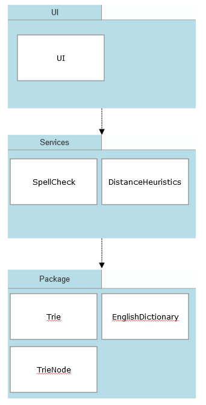

# Implementation document

## Project structure

### Overview

Application has three layers: presentation tier (UI), logic tier (services) and data tier (repositories). Code is packaged as follows:

__ui__, __services__, and __repositories__ include code for the user interface, application's core functionalities, and storage and handling of data, respectively.

### User interface (UI)

User interface is very simple. It consists of one class, [UI](../src/ui/ui.py), that is responsible for interacting with the user, and calls for relevant methods from the Spellcheck class.

### Services

Services provide the application's core functionalities of checking whether the word(s) given by the user are English, and if they are not, suggesting English words based on different distance metrics and heuristics. It consists of two classes:
* Class [SpellCheck](../src/services/spell_check.py) provides core functionalities for spellchecking using different algorithms. It suggests (0) words generated with a one Damerau-Levenshtein distance (simplistic approach), and words selected from all the English words in the application's dictionary based on a distance metric calculated by (1) Levenshtein distance, (2) Optimal string alignment distance, and (3) full Damerau-Levenshtein distance, while taking into account the frequency of using the word in English texts.
* Class [DistanceHeuristics](../src/services/heuristics.py) provides methods to calculate distance heuristic between two characters in a keyboard. It is used by the [SpellCheck](../src/services/spell_check.py) in calculation of the distance metric.

### Repositories

Repositories provide the following services for the logic tier:  
* Class [EnglishDictionary](../src/repositories/db_utilities.py) is responsible for fetching words used in the application's dictionary, and populating the spellchecker's trie data structure with English words and their frequencies.
* Class [Trie](../src/repositories/trie.py) is responsible for creating the overall data trie structure, and provides the key operations (insertion and searching) to access the data structure.
* Class [TrieNode](../src/repositories/trie.py) is responsible for creating one node in the trie data structure.

## Implemented time and space complexities

The core data structure used in the algorithm is trie, a digital tree data structure, and the core algorithm is the Damerau-Levenshtein. Here, time and space complexities for only their core functionalities are covered.

Implementation of the **trie data structure** follows the general principles for the trie data structure. As a result, it is reasonable to assume that its time and space complexities follow those for a standard trie data structure. Creation of one trie node has time and space complexities of O(1), because no additional time or space are required to initialize data items or additional memory, respectively (Source: [PythonWide: Trie in Python, 2022](https://pythonwife.com/trie-in-python/)). Regarding the overall trie data structure operations, search and insert have on average time complexity of O(n) and in worst case O(n) (Source: [Wikipedia: Trie, 2022](https://en.wikipedia.org/wiki/Trie). The overall space complexities are on average O(n) and in worst case O(n) (Source: [Wikipedia: Trie, 2022](https://en.wikipedia.org/wiki/Trie)). 

Regarding the **distance calculation** used to identify words to replace the misspelled word, three alternative implementations of the Damerau-Levenshtein algorithm were done.

1. **Levenshtein distance** allows insertions, deletions, and symbol substitutions to transform user's misspelled word into a proper English word in the dictionary. No optimizations were done in the implementation, and the implementation was based on an iterative approach using a full matrix. For reference, please see e.g. [Wikipedia: Levenshtein distance, 2022](https://en.wikipedia.org/wiki/Levenshtein_distance) and [Wikipedia: Wagner-Fischer algorithm, 2022](https://en.wikipedia.org/wiki/Wagner%E2%80%93Fischer_algorithm). As implementation follows the general principles, it is reasonable to assume that the time and space complexities follow those in the literature. Hence, the time complexity for the algorithm is O(mn), and also space complexity of O(mn), where m and n stand for the length of the two words being compared (sources: [Wikipedia: Wagner-Fischer algorithm article (2022)](https://en.wikipedia.org/wiki/Wagner%E2%80%93Fischer_algorithm), [Grashchenko (2021)](https://www.baeldung.com/cs/levenshtein-distance-computation)).

2. **Optimal string alignment distance** (OSA) allows insertions, deletions, and symbol substitutions as well as transposition to transform from the user's misspelled word into a proper English word in the dictionary. It does not allow for multiple transformations on the same substring. Similarly to Levenshtein distance, no optimizations were done in the implementation, which is based on an iterative approach using a full matrix. The only difference between the Levenshtein and Optimal string alignment distance is, that OSA allows also transposition. It seems reasonable to conclude that this does not influence the space and time complexities, i.e. they are both O(mn).

3. **Damerau Levenshtein distance** allows insertions, deletions, and symbol substitions as well as transposition to transform from the user's misspelled word into a proper English word in the dictionary. The difference to OSA is that Damerau Levenshtein allows for multiple transformations on the same substring. When looking at the code, it seems reasonable to conclude that this does not influence the space and time complexities, which are both O(mn). 

It is important to note that the algorithm goes through all the words from the dictionary that are the same length or +/- 1 length from the misspelled word (O(k)). Thereafter, the algoritm calculates the edit distance between the misspelled word and the words from the dictionary (O(mn)). This combined loop is the point of slowness in the application, as the time complexity increases to O(kmn). Space complexity does not increase similarly, as individual words are compared, and the highest combined space requirement comes from the distance calculation, i.e. O(mn). 

Please note that as the project is not focused on applications' performance, comparative performance and complexity analysis are not done.

## Possible flaws and improvements

There are a number of areas of improvement in the application. 
* Completeness of the dictionary: Baseline database consists of ~150,000 words, but it does not consistently include e.g. different conjugations of the words. As a result, such simple words as 'is' or 'this' are not recognized as English. These limitations could be alleviated by e.g. using the British National Corpus (currently not possible due to copyright reasons) or Python's nltk library (not done following the instructions for the project) as baseline for dictionary, or enabling user to add their own words to the dictionary. 
* Limitations in handling special characters: Application handles inputs only for English alphabet characters (Aa-Zz); all punctionation marks are excluded. As a result, such phrase as 'John's dictionary' would only recognize 'dictionary' as English word. Limitation was done for the sake of simplicity, and expansion of the application is possible.
* Availability of word frequencies: As British National Corpus data cannot be used as a basis for the dictionary due to copyright reasons, the usage frequencies for the words in the texts and matched with the Princeton University's WordNet dictionary's words. This results in a sizeable loss of frequency data. 
* Speed and efficiency of the algorithm: The algorithms used in the application were coded to be explicit about every step of the distance calculation. As a result, no space or time efficiency improvements have been made, and when the word length increases, the application can seem fairly slow. Calculation of the Wagner-Fischer algorithm can be made more time efficient with certain optimizations. Also, making the reasonable assumption that the word's first character is correct, could speed-up the search of alternative words significantly. 
* UI: Current UI is quite simplistic, as the focus of the work has been in the application's algorithms and data structures. Graphical UI for writing and editing the sentences could improve the visuals of the application notably.

## Sources

Multiple sources of data, articles to understand the different algorithms, and examples for implementation of the algorithms have been used. Please find the most relevant sources below.

### Data

Baseline for the **English language words** used in the application is provided by Princeton University's [WordNet](https://wordnet.princeton.edu/), which consists of ~150,000 commonly used English words. This application is developed complying with the [WordNet 3.0 license](https://wordnet.princeton.edu/license-and-commercial-use) that maintains the copyright with the Princeton University. Please see the copyright text below. 

**Usage frequencies** for the words used in the application are based on analysis of texts in the [British National Corpus XML Edition](https://ota.bodleian.ox.ac.uk/repository/xmlui/handle/20.500.12024/2554), downloaded from the Oxford Text Archive. (Source: BNC Consortium, 2007, British National Corpus, XML edition, Oxford Text Archive, http://hdl.handle.net/20.500.12024/2554.) British National Corpus containts texts with ~100,000,000 words from both written and spoken English from the beginning of the 1990s. Use of the database is restricted and licensed under [BNC User Licence](http://www.natcorp.ox.ac.uk/docs/licence.html). As a result, no data directly from the database is shared here; only frequencies calculated based on the texts are used in this application. Similar analysis of data is available at [Wiktionary](https://en.wiktionary.org/wiki/Wiktionary:Frequency_lists). 

In total, this application's dictionary consists of ¨150,000 words. ~57,000 of these words have frequency data available; for the rest of the words, the usage frequency is assumed to be 1. When the full dictionary is limited only to words consisting of characters in the English alphabet, the application handles ~77,000 words on a continuous basis.

During application's **relevance tests**, data from Wikipedia's [list of common misspelled English words](https://en.wikipedia.org/wiki/Wikipedia:Lists_of_common_misspellings/For_machines) was used. Testing was limited to words consisting of English alphabets, e.g. no special characters were allowed. Also the aforementioned Princeton University's [WordNet](https://wordnet.princeton.edu/) data was used is testing. 

### Trie data structure

Trie data structure and its implementation are quite well documented. In the development, especially the following sources were considered useful: [Wikipedia: Trie, 2022](https://en.wikipedia.org/wiki/Trie), [AskPython, 2022](https://www.askpython.com/python/examples/trie-data-structure), and [Yeung, 2020](https://albertauyeung.github.io/2020/06/15/python-trie.html/). The theoretical background was provided by [de la Briandais (1959)](https://dl.acm.org/doi/pdf/10.1145/1457838.1457895) and [Fredkin (1960)](https://dl.acm.org/doi/10.1145/367390.367400).

### Distance metrics

Approach for calculating the **distance metrics** follows [Damerau (1964)](https://dl.acm.org/doi/abs/10.1145/363958.363994). There are a few minor differences, though. For example, while Damerau(1964) limits the spellchecking to words longer than 3 characters, and checks only high occurrency words from the dictionary for words with 4-6 characters, no such limitations are needed here, as computer's calculation power is nowadays higher. 

In the implementation, multiple sources have been studied. The most important have been: [Wikipedia: Damerau-Levenhstein distance (2022)](https://en.wikipedia.org/wiki/Damerau%E2%80%93Levenshtein_distance), [Wikipedia: Wagner-Fischer algorithm article (2022)](https://en.wikipedia.org/wiki/Wagner%E2%80%93Fischer_algorithm), [Wikipedia: Levenshtein distance (2022)](https://en.wikipedia.org/wiki/Levenshtein_distance), and examples of distance metrics calculation and implementation from [Jensen (2022)](https://www.lemoda.net/text-fuzzy/damerau-levenshtein/index.html), [Grashchenko (2021)](https://www.baeldung.com/cs/levenshtein-distance-computation), and [Norvig (2016)](http://norvig.com/spell-correct.html).

In the **keyboard heuristics**, QWERTY US keyboard is used as the baseline keyboard, because QWERTY is the most widespread layout in use (source: [Wikipedia: QWERTY, (2022)](https://en.wikipedia.org/wiki/QWERTY)). US variant is used, because there is no need for regional variants (only English alphabets are allowed in the application). Examples on how to consider keyboard distances was provided by [Burton, 2002](https://metacpan.org/pod/String::KeyboardDistance).

### Key licenses

Please note that the English words used in the application are provided by the **Princeton University's [WordNet](https://wordnet.princeton.edu/)** based on the following copyright: 

WordNet 3.0 license: (Download)

WordNet Release 3.0 This software and database is being provided to you, the LICENSEE, by Princeton University under the following license. By obtaining, using and/or copying this software and database, you agree that you have read, understood, and will comply with these terms and conditions.: Permission to use, copy, modify and distribute this software and database and its documentation for any purpose and without fee or royalty is hereby granted, provided that you agree to comply with the following copyright notice and statements, including the disclaimer, and that the same appear on ALL copies of the software, database and documentation, including modifications that you make for internal use or for distribution. WordNet 3.0 Copyright 2006 by Princeton University. All rights reserved. THIS SOFTWARE AND DATABASE IS PROVIDED "AS IS" AND PRINCETON UNIVERSITY MAKES NO REPRESENTATIONS OR WARRANTIES, EXPRESS OR IMPLIED. BY WAY OF EXAMPLE, BUT NOT LIMITATION, PRINCETON UNIVERSITY MAKES NO REPRESENTATIONS OR WARRANTIES OF MERCHANT- ABILITY OR FITNESS FOR ANY PARTICULAR PURPOSE OR THAT THE USE OF THE LICENSED SOFTWARE, DATABASE OR DOCUMENTATION WILL NOT INFRINGE ANY THIRD PARTY PATENTS, COPYRIGHTS, TRADEMARKS OR OTHER RIGHTS. The name of Princeton University or Princeton may not be used in advertising or publicity pertaining to distribution of the software and/or database. Title to copyright in this software, database and any associated documentation shall at all times remain with Princeton University and LICENSEE agrees to preserve same.