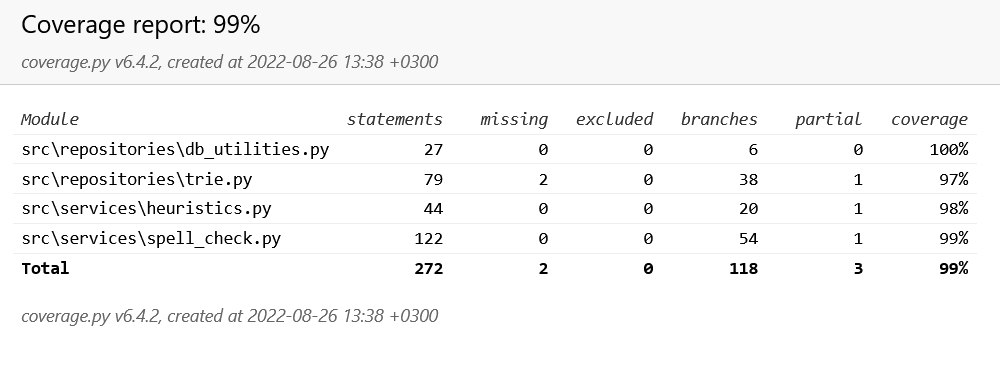
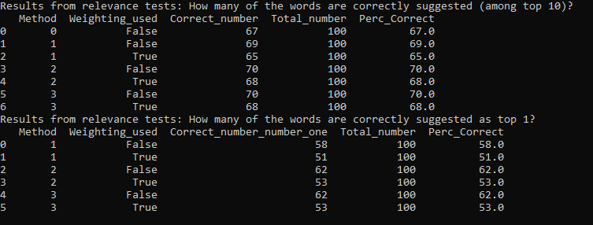
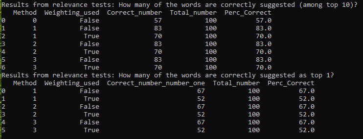
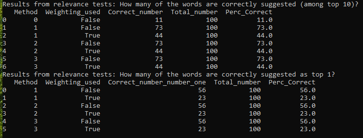

# Testing document

## Overview of the tests

Application has been tested both manually and automatically with unit and integration tests with unittest. Both manual and automated testing for the relevance of results (suggested words) have been conducted.

## Unit and integration tests

Unit and integration tests are automated and cover all classes, excluding UI, following common approach in the faculty's classes.

Unit and integration tests can be run with the following command: 

```bash
poetry run invoke test
```

Unit and integration tests are also automatically run as part of the application's GitHub Actions CI pipeline when the the application is pushed to the GitHub repository. Results are visible in codecov. 


[](https://codecov.io/gh/katriryt/Tiralabra-2022-VerbumReprehendo)

### Services (core functionality)

`SpellCheck` and `DistanceHeuristics` classes are tested with [TestSpellCheck](../src/tests/spell_check_test.py) and [TestDistanceHeuristics](../src/tests/heuristics_test.py) test classes, respectively. Inputs used are strings of words with English and Scandinavian alphabets, to check that input checks are working correctly.

### Repositories Classes

Repository classes `TrieNode` and `Trie` are tested with [TestTrie](../src/repositories/trie.py) test class. `English Dictionary` class is covered through other test classes' tests. 

### Test coverage

An HTML-format test coverage report can be generated with the following command:

```bash
poetry run invoke coverage-report
```

The report is generated in the _htmlcov_ folder.

Please see the overall test coverage below. 



Tests focus on the most relevant methods and features.

## System testing

Application's test in different operating system - Windows and Ubuntu - has been done manually. Tests have been conducted on both environments.

## Relevance testing

Relevance tests have been done both manually and automatically. 

**Manual tests** suggest that the algorithms are at the moment quite capable of suggesting the original word intended within the top 10 best alternative words. There does not seem to be difference in the performance of the different distance metrics. Using keyboard heuristics seems to improve the suggestions, and using frequencies improves the relevance of suggestions quite significantly. However, it is important to prioritize suggestions first based on keyboard heuristic, and only after that use the frequencies. If frequencies are used in the priorization with a larger weight than the distance metrics, the results become highly inaccurate, i.e., the algorithm suggests completely wrong words.

**Automated relevance tests** for the results have been done using three different data sets: 
* Wikipedia's [list of most typically misspelled English words](https://en.wikipedia.org/wiki/Wikipedia:Lists_of_common_misspellings/For_machines)
* Princeton University's Wordnet data, making one random change for the characters in the English word
* Princeton University's Wordnet data, making two random changes for the characters in the English word

For each data set, suggestions for the misspelled words, generated by the different distance metrics (simplistic approach (method 0), Levenshtein (method 1), Optimal string alignment (method 2), and Damerau-Levenshtein distances (method 3)) with/without keyboard heuristics (weighting used True/False), and considering the frequency of the word used in the English language (included in all distance based methods), are compared.

Automated relevance tests' scripts and test data sets are available in the [Utilities](../src/utilities/) folder, [RelevanceTests](../src/utilities/relevance_test_script.py) class.

Automated relevance tests can be run in Windows with the following command: 

```bash
python src/relevance_test_index.py
```

Please use the following command in Linux:

```bash
poetry run invoke relevance-test
```

Relevance tests take quite a long time to execute, so they are not part of the usual tests run for the application. 

In the automated relevance tests conducted, each test set was run with 100 different test words that are randomly chosen for each run from the underlying data sets. The results are as follows: 

* Automated tests: Most typical misspelled words in English (word of any length)

    

    When test set is the most typical misspelled words in English, we can see that there is no significant difference in the quality of suggestions for the English words. All methods, even the simplistic approach, get ~70% of the words correct, i.e. the correct word is within the top 10 words suggested. The first word suggested is typically the first word suggested. The use of weighting in keyboard heuristics does not seem to influence the results significantly.

* Automated tests: Princeton University's Wordnet data, one random error (word length between 5 and 10 characters)

    

    When test set is the Princeton University's Wordnet data, where the words contain one random error, the results are largely the same as above, though the simplistic method seems to fare worse than previously. Use of heuristics has no significant impact, which is reasonable, given that the heuristic prioritizes suggestions where the wrongly typed character is close to the wanted character.

* Automated tests: Princeton University's Wordnet data, two random errors (word length between 5 and 10 characters)

    

    When test set is the Princeton University's Wordnet data, where the words contain two random errors, the results become very interesting. As in all previous cases, the overall ability of the algorithm to find correct words remains around 70%, when distance metrics are used. However, the simplistic algorithm no longer can identify the correct words. Also, when weighting is used, the ability of the distance metrics decreases significantly. This is reasonable, given that the prioritization logic of the heuristic no longer is valid. Further, the ability of the distance based algorithms to identify the correct word as the first suggestion decreases notably.

It is important to note that though the test results above indicate that the application is able to identify individual words quite accurately (70-80% of the test words are found), the dictionary in the application does not include e.g. conjugations of common verbs. Hence, in manual testing, it seems that the application cannot identify quite common English words.

## Other tests

In line with the project specification, tests for application's performance (e.g. how quickly the different metrics can suggest spellchecked words) are not conducted. Focus of the work was not in the application's efficiency, but in the accuracy. However, during the relevance testing, it was noted that when the misspelled words are long, the application seems quite slow.

## Quality

Pylint and autopep8 are used to help identifying and correcting for quality errors. Please see the relevant commands below.

### Pylint

Checks as defined by .pylintrc can be implemented with the following command: 
```bash
poetry run invoke lint
```

### autopep8 formatting

Formats code according to pep8 standard: 
```bash
poetry run invoke format
```

### Remaining quality errors

A few issues highlighted by pylint have been left in the code, such as docstring has not been added in constructors whose purpose is self evident. Also in a few instances, the 'less elegant' implementations have been left in the code, in order to make the code extremely explicit for the developer / reviewer. 