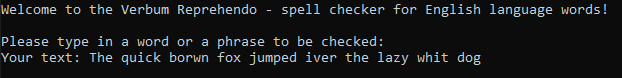
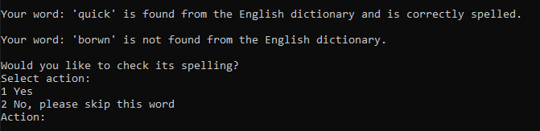
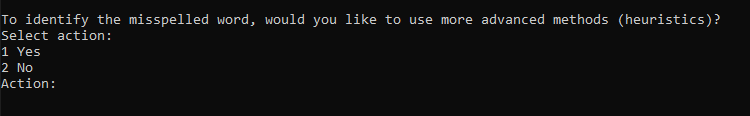
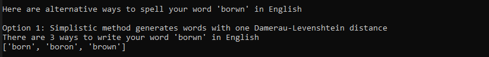
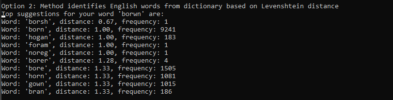
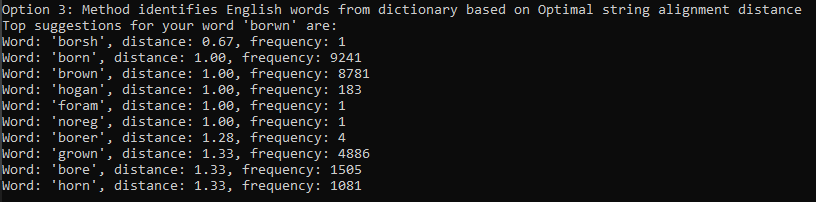
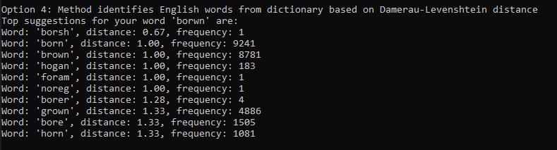
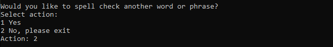

# User guide

## Introduction 

Application requires using Python ^3.8.

## Installing the application 

Install dependencies with the following command: 

```bash
poetry install
```

## Running the application 

Start the application with the following command in Windows: 

```bash
poetry shell
python src\index.py
```
Please use the following command in Linux:

```bash
poetry run invoke start
```

## Using the application

**Verbum Reprehendo** is a very simple, command line based, spell checker for the most common English words.

### Text inputs

Once the application is started, the user is asked to type in text (a phrase or a word) whose spelling they would like to check.



Application accepts only English alphabets Aa-Zz as inputs. If the user types in e.g. Scandinavian characters, the application gives an error message and will not handle the word with the non-English characters. If punctuation marks, such as a question mark, an exclamation point, a point, or a comma are typed in, the application assumes that these indicate an ending for a particular word, and will handle the rest of the word as (misspelled) English word. 

### Checking the spelling

The application handles the users' input one word at a time. First, the application checks whether a word from the users' phrase is English or not. If the word is found from the dictionary, it is deemed to be English. 



If the word is not found from the dictionary, the user is asked whether they want to check its spelling or skip it. If the word is to be skipped, the application starts to check the following word in the phrase. 

The application also asks the user whether more advanced methods, essentially keyboard heuristics, are to be used to develop relevant suggestions for the misspelled word. 



If one chooses no, all keyboard characters are assumed to be of similar importance. If one chooses yes, weighted keyboard heuristics will be used; characters close to each other are considered to be 'smaller errors' than the characters having a longer physical distance in the keyboard. 

### Showing suggestions

Thereafter, the application shows 10 best suggestions for the misspelled word based on four different methods: 
* (0) Simplistic approach suggests English words that are one Damerau-Levenshtein distance from the misspelled word (note: all potential words are shown)

    

* (1) Algorithm identifies words from the English dictionary that have (a) the shortest distance from the misspelled word calculated based on Levenshtein distance metric, and (b) the highest frequency among the words with the shortest distance

    

* (2) Similar approach as (1), except that the distance is calculated based on Optimal string alignment

    

* (3) Similar approach as (1), except that the distance is calculated based on Damerau-Levenshtein distance

    

Once one word is fully handled, the application moves on to the next word, checking whether it is English, and if not, suggesting alternative spellings for it.

### Ending the application

Once the entire phrase typed by the user is checked, the user is asked whether to exit the application. If yes, the application is closed. If no, the user can type in another phrase to be checked. 

